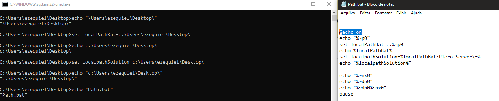

# Apresentação

Este é um exemplo didático de um arquivo .BAT para coletar a localização do proprio arquivo no windows.

# Requisitos

Para executar é necessário:
* Ter Windows instalado, qualquer versão.

# Instalação

Não há necessidade de instalação, basta executar o **Path.bat**.

# Como utilizar

Basta executar e para alterar:  
* **Abra em qualquer editor de texto preferido**: Altere a vontade para aprendizado, utilize as referencias para obter o conhecimento de outros comandos e utilização;

# Pacotes de terceiro

* NA

# Autor

Ezequiel da Silva Daniel  
[Blog](https://ezequieldaniel.wordpress.com/)  
[Email](ezequielsd@gmail.com)

# Licença

[MIT]

# Release

A versão Release do programa, apenas executável, pode ser baixado no link abaixo:

[Path](/Release/Path.bat)
